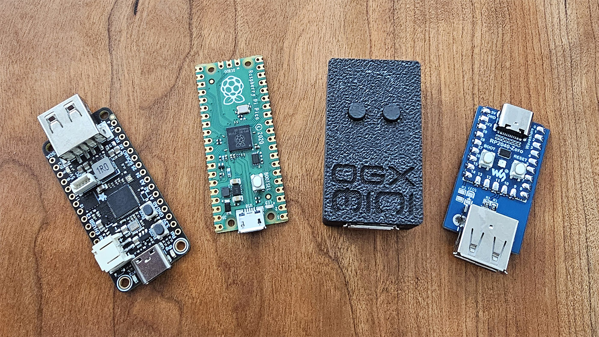
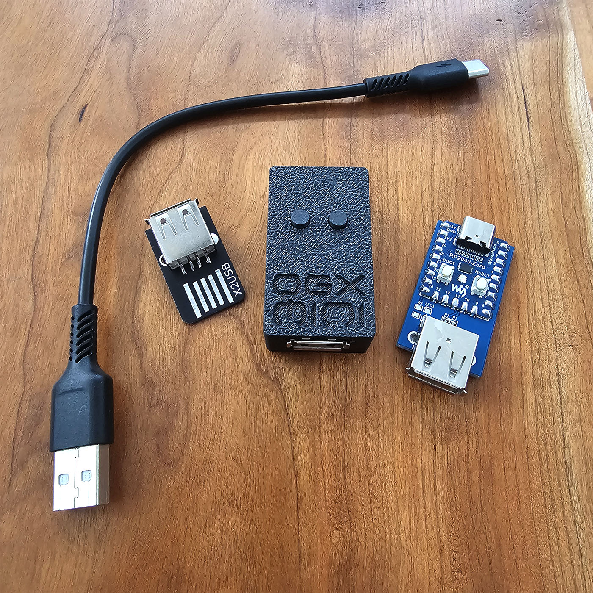

# OGX-Mini Plus

`OGX-Mini Plus` is an RP2040-based controller converter firmware focused on console compatibility, controller translation, and practical adapter use with Raspberry Pi Pico family boards, RP2040-Zero, Pico W / Pico 2 W, hybrid Pico + ESP32 setups, and external 4-channel configurations.

This project is a hard fork of [wiredopposite/OGX-Mini](https://github.com/wiredopposite/OGX-Mini), created to extend support for additional devices, fix long-standing controller issues, and keep the build process self-contained with forked submodules and project-specific patches.

Current release information is tracked in [.versions/ReleaseNotes.md](.versions/ReleaseNotes.md).

## Quick Links

- [Controllers and compatibility](Controllers.md)
- [Release notes and version history](.versions/ReleaseNotes.md)
- [Compilation guide](CompileHelp.md)
- [Hardware diagrams and board files](hardware/README.md)
- [Web App](https://wiredopposite.github.io/OGX-Mini-WebApp/)

## What This Fork Adds

- Broader support for licensed and multi-system controllers
- Pro Controller Clone support
- DualShock 3 host driver fixes
- Native DualShock 4 host support
- PS2 to USB adapter support improvements
- Native Xbox 360 Rock Band guitar support using compatible PS3 guitars
- Fixes for Nintendo Switch Pro trigger support over Bluetooth
- Improved handling for third-party Switch Pro compatible controllers
- USB rumble support for Switch Pro compatible controllers

## Documentation

- [Controllers.md](Controllers.md)
  Platform support, controller compatibility, button combos, and usage notes.

- [.versions/ReleaseNotes.md](.versions/ReleaseNotes.md)
  Release history for this fork, including major fixes and newly supported devices.

- [CompileHelp.md](CompileHelp.md)
  Required tool versions, submodule expectations, build commands, and troubleshooting for reproducible firmware builds.

## Hardware

For Pi Pico, RP2040-Zero, 4-channel, and ESP32 configurations, see the files in [hardware](hardware/README.md).

This repository also includes RP2040-Zero hardware files for building a compact adapter.

## Support Notes

If a third-party controller is not working but the original version is supported, the most useful information to collect is:

- USB VID/PID
- Report descriptor data
- Initialization behavior
- Any differences between wired and Bluetooth modes

These dumps are often enough to add or refine support for new devices.
